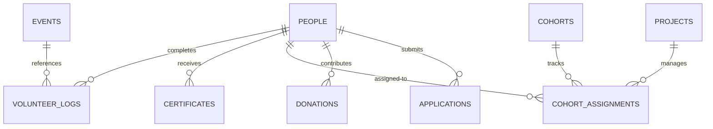

# Backend Integration Blueprint

This document maps out the backend and database integration strategy, detailing expected REST API endpoints, database schemas, file storage architectures, and prioritized development phases.

---

## Document Metadata
* **Owner**: Backend Integration Team
* **Maintainer**: Technical Lead
* **Reviewer**: Lead Developer
* **Last Updated**: June 4, 2026
* **Dependencies**: [docs/architecture/platform-overview.md](file:///d:/Desktop/Amaanitvam-Internship/amaanitvam-platform/docs/architecture/platform-overview.md)

---

## 1. Prioritization & Integration Matrix

To facilitate a structured migration from mock data structures to a live production database, development is split into three priority phases:

### Integration Phases

```text
+---------------------------------------------------------------------------------+
|                                PHASE 1: CORE CRM                                |
| - Users / Session Auth (JWT)                                                    |
| - Volunteers (Profile, Hours)                                                   |
| - Internships (Kanban screening, Cohorts, Projects)                              |
| - Certificates Registry (Signed issue registry)                                 |
+---------------------------------------------------------------------------------+
                                         |
                                         v
+---------------------------------------------------------------------------------+
|                              PHASE 2: COMMUNITY ENG                             |
| - Events Listing & Registration                                                 |
| - Contacts & Support Inquiries sorting                                          |
| - Donation Ledger Mapping (Calculators & Stripe checkout triggers)               |
+---------------------------------------------------------------------------------+
                                         |
                                         v
+---------------------------------------------------------------------------------+
|                             PHASE 3: ADMIN SCALE                                |
| - Global Search Queries Mapping                                                 |
| - SLA SLA Performance metrics logger                                            |
| - Audit logs tracking DB changes                                                |
| - Real-time email alerts (SMTP templates)                                       |
+---------------------------------------------------------------------------------+
```

---

## 2. API Endpoint Specifications

All APIs should conform to standard REST guidelines, utilizing JSON payloads and JWT authorization headers.

### 2.1 Authentication & Profile Registry (Phase 1)
* **`POST /api/auth/login`**: Authenticate administrator or volunteer credentials. Returns JWT.
* **`POST /api/auth/register-volunteer`**: Submit volunteer onboarding details.
* **`GET /api/profile`**: Retrieve active demographic summary (requires JWT).
* **`PUT /api/profile`**: Update contact numbers, skills, and preferences.

### 2.2 Volunteer & Internship Actions (Phase 1)
* **`POST /api/volunteer/applications`**: Submit application details.
* **`GET /api/admin/people`**: Filter list of Volunteers/Interns (requires Admin role).
* **`GET /api/admin/people/:id`**: Return 360-degree participant history registry (requires Admin role).
* **`POST /api/admin/applications/:id/review`**: Add evaluation notes and coordinator assignments.

### 2.3 Certificate Issuance & Validation (Phase 1)
* **`POST /api/admin/certificates`**: Create a signed certificate record (requires Cert Manager role).
* **`GET /api/certificates/verify/:id`**: Query the public registry to verify a tracking ID.

### 2.4 Events, Inquiries, & Support (Phase 2)
* **`GET /api/events`**: Retrieve listing of active community actions.
* **`POST /api/events/:id/register`**: Submit registration details.
* **`POST /api/inquiries`**: Route a support inquiry (generates priority parameters).
* **`POST /api/donations`**: Map donation transaction records.

---

## 3. Database Schema Planning

Below is the planned relational database entity layout:



### 3.1 Core Entity Definitions
* **`People`**: `id` (PK), `name`, `email`, `phone`, `type` (enum), `status` (enum), `created_at`.
* **`Certificates`**: `id` (PK), `recipient_id` (FK), `type` (enum), `status` (enum), `issue_date`, `hash_signature`.
* **`Donations`**: `id` (PK), `donor_id` (FK), `amount`, `currency`, `intent` (enum), `transaction_id`, `created_at`.
* **`Applications`**: `id` (PK), `applicant_id` (FK), `domain` (enum), `status` (enum), `reviewer_id` (FK), `notes`.

---

## 4. File Storage Strategy

The platform requires a centralized, secure strategy to manage document and asset uploads:

### 4.1 Storage Matrix

| Upload Type | Expected Format | Expected Size | Target Storage Solution | Access Control |
| :--- | :--- | :--- | :--- | :--- |
| **Resumes** | PDF / DOCX | < 5 MB | Secure S3 Bucket | Restricted (Admin-only) |
| **Certificates** | PDF | < 2 MB | Public S3 Bucket | Read-only Public |
| **Event Gallery** | JPG / PNG | < 10 MB | Cloudinary CDN | Read-only Public |
| **Outreach Reports**| PDF | < 15 MB | Public S3 Bucket | Read-only Public |

### 4.2 Storage Rules
* **Upload Gateway**: All uploads must pass through a backend endpoint (e.g. `POST /api/uploads`) that validates the MIME type and scans for viruses before storing the file.
* **CDNs**: Static assets (like event photos) must be optimized and served via a Content Delivery Network (CDN) to ensure fast loading times globally.
