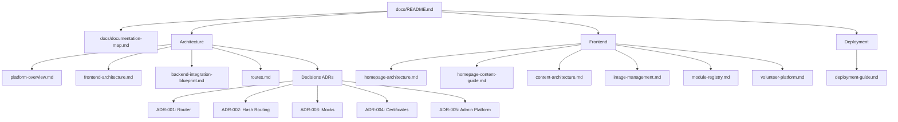

# Documentation Map & Index

This map provides a visual and category-based navigation layout for all documentation files in the repository.

---

## Document Metadata
* **Owner**: Architecture Team
* **Maintainer**: Shashank Shekhar
* **Reviewer**: Technical Core Team
* **Last Updated**: June 4, 2026
* **Dependencies**: [docs/README.md](file:///d:/Desktop/Amaanitvam-Internship/amaanitvam-platform/docs/README.md)

---

## 1. Directory Tree Map

---

## 2. Directory Matrix

### System Architecture
* **[Platform Overview](file:///d:/Desktop/Amaanitvam-Internship/amaanitvam-platform/docs/architecture/platform-overview.md)**: Unified operational CRM view mapping components, page levels, and long-term roadmap objectives.
* **[Frontend Architecture](file:///d:/Desktop/Amaanitvam-Internship/amaanitvam-platform/docs/architecture/frontend-architecture.md)**: Complete guide to our custom SPA layout engine, rendering cycle, client state, and custom router details.
* **[Backend Integration Blueprint](file:///d:/Desktop/Amaanitvam-Internship/amaanitvam-platform/docs/architecture/backend-integration-blueprint.md)**: Mocks-to-database contract structures, authentication scopes, file storage systems, and phase prioritization.
* **[Route Registry](file:///d:/Desktop/Amaanitvam-Internship/amaanitvam-platform/docs/architecture/routes.md)**: Matrix of all SPA route hashes detailing permissions and backend requirements.

### Architecture Decision Records (ADRs)
* **[ADR-001: Custom JS SPA Engine](file:///d:/Desktop/Amaanitvam-Internship/amaanitvam-platform/docs/architecture/decisions/ADR-001-spa-routing.md)**: Rationale for skipping major client libraries (React/Vue) in favor of lightweight ES6 classes.
* **[ADR-002: Hash Routing Selection](file:///d:/Desktop/Amaanitvam-Internship/amaanitvam-platform/docs/architecture/decisions/ADR-002-hash-routing-choice.md)**: Rationale for window hash routing to avoid server-side rewrite constraints.
* **[ADR-003: Mock-First Strategy](file:///d:/Desktop/Amaanitvam-Internship/amaanitvam-platform/docs/architecture/decisions/ADR-003-mock-data-strategy.md)**: How offline relational mock tables enable parallel frontend/backend development.
* **[ADR-004: Certificate Verification Architecture](file:///d:/Desktop/Amaanitvam-Internship/amaanitvam-platform/docs/architecture/decisions/ADR-004-certificate-verification-system.md)**: Security framework for checking integrity, issuing IDs, and preventing certificate forgery.
* **[ADR-005: Admin Platform Relational CRM Model](file:///d:/Desktop/Amaanitvam-Internship/amaanitvam-platform/docs/architecture/decisions/ADR-005-admin-platform-architecture.md)**: Structuring the admin operations system around a centralized People registry database.

### Frontend & Asset Development
* **[Homepage Architecture](file:///d:/Desktop/Amaanitvam-Internship/amaanitvam-platform/docs/frontend/homepage-architecture.md)**: Component files map, connection threads, and layouts of the landing page.
* **[Homepage Content Guide](file:///d:/Desktop/Amaanitvam-Internship/amaanitvam-platform/docs/frontend/homepage-content-guide.md)**: Rules for CTA destinations, statistics text, and updating landing copy.
* **[Content Architecture Guide](file:///d:/Desktop/Amaanitvam-Internship/amaanitvam-platform/docs/frontend/content-architecture.md)**: Separating hard-coded template components from dynamic config files inside `src/content/`.
* **[Image Asset Governance](file:///d:/Desktop/Amaanitvam-Internship/amaanitvam-platform/docs/frontend/image-management.md)**: Image compression, file formats, aspect ratios, and naming standards.
* **[Module Registry](file:///d:/Desktop/Amaanitvam-Internship/amaanitvam-platform/docs/frontend/module-registry.md)**: Verification and completion status index of modules.
* **[Volunteer Platform Workflow](file:///d:/Desktop/Amaanitvam-Internship/amaanitvam-platform/docs/frontend/volunteer-platform.md)**: Functional workflows of the Volunteer Portal, Dashboard, session caching, and mock APIs.

### Setup & Deployments
* **[Deployment & Startup Guide](file:///d:/Desktop/Amaanitvam-Internship/amaanitvam-platform/docs/deployment/deployment-guide.md)**: Local start commands, build variables, production bundling, and deployment checklists.
