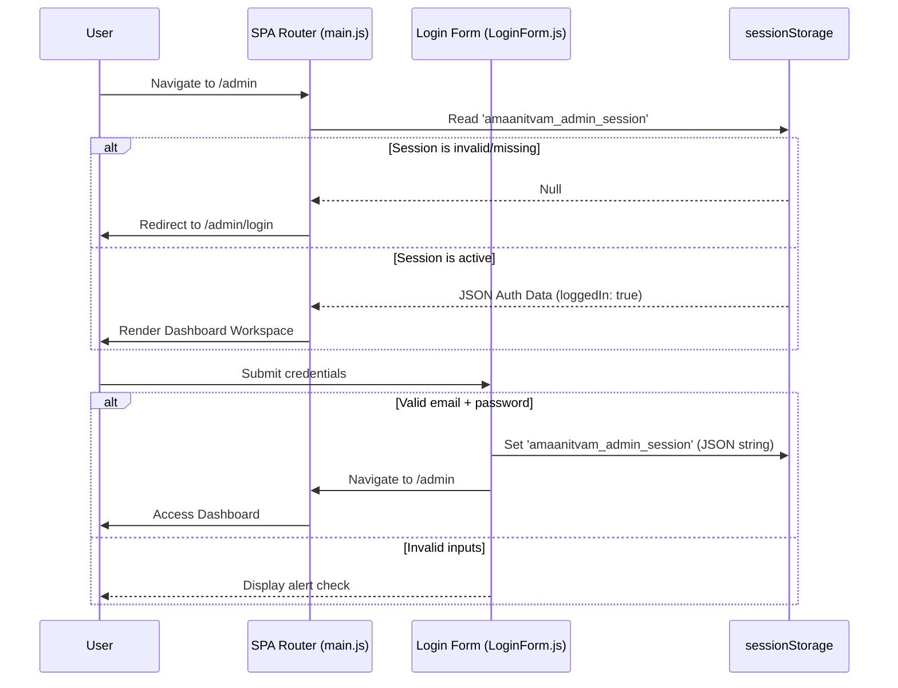

# Admin Console Authentication (Mock Strategy)

This document provides a guide to the client-side authentication and session guard patterns implemented on the Amaanitvam Foundation Platform's Admin Portal. 

---

## Current State & Mock Architecture

The Amaanitvam Admin Portal is protected by a client-side routing guard during active Single Page Application (SPA) layout loads. Because this is a static prototype mockup environment, the authentication layer uses mock session credentials stored in the browser's `sessionStorage`.



---

## Mock Login Logic

The mock console accepts any valid email structure (`name@domain.ext`) and non-empty password. However, it maps specific email entries to administrative roles to assist development and dashboard feature checks.

### Mock Test Accounts

All pre-configured testing accounts share the same password: **`demo123`**

| Mock Email Address | Assigned Role | Usage Area |
| :--- | :--- | :--- |
| `coordinator@amaanitvam.org` | **Coordinator** | Event drafts, rosters |
| `volunteer@amaanitvam.org` | **Volunteer Lead** | Roster operations, logs |
| `internships@amaanitvam.org` | **Internship Coordinator** | Kanban reviews, cohort maps |
| `certificates@amaanitvam.org` | **Certificate Manager** | Credentials verification queue |
| `finance@amaanitvam.org` | **Finance Manager** | Treasury lists, donation summaries |
| `events@amaanitvam.org` | **Events Coordinator** | Campaign setups, reports |

Any other valid email is assigned the generic **`Admin`** role.

---

## Protected Session Storage Schema

A structured JSON string is written to `sessionStorage` under the key **`amaanitvam_admin_session`**:

```json
{
  "role": "Coordinator",
  "email": "coordinator@amaanitvam.org",
  "loggedIn": true
}
```

### Route Guard Implementation: [main.js](file:///d:/Desktop/Amaanitvam-Internship/amaanitvam-platform/frontend/src/main.js)
The router matches the dynamic path segments. When a route contains the `authRequired: true` and `roleScope: 'admin'` flags:
1. It reads `sessionStorage.getItem('amaanitvam_admin_session')`.
2. It parses the JSON string in a `try-catch` block.
3. If parsing fails, or the `loggedIn` parameter is not strictly `true`, it intercepts navigation and forces redirect state replacement to `/admin/login`.

---

## Logout Logic: [AdminLayout.js](file:///d:/Desktop/Amaanitvam-Internship/amaanitvam-platform/frontend/src/components/admin/AdminLayout.js)

Clicking the **Logout** button on the Top Navigation Bar triggers the following session clean-up sequence:
1. Clears session values: `sessionStorage.removeItem('amaanitvam_admin_session')`.
2. Navigates back to the clean URL: `/admin/login`.

---

## Backend Integration Requirements

When converting this platform from a static mockup to a production service with actual database backing, the following points will be replaced:

1. **Authentication Endpoint:**
   `LoginForm.js` submit handler must make a `POST` request (e.g., `/api/v1/auth/login`) transmitting email and password.
2. **Tokens Storage:**
   Instead of writing `"loggedIn": true`, the server will return an authorization token (JWT, secure HttpOnly cookie, or Session ID). Store the token or user metadata in the session storage.
3. **Session Interceptor Guard:**
   `main.js` route guard must be updated to inspect cookies or send an authorization token on api calls, handling `401 Unauthorized` responses by redirecting the client back to `/admin/login`.
4. **Role-Based Access Controls (RBAC):**
   Extend the route scope checks to enforce sub-role constraints (e.g., preventing the `Finance Manager` from loading `/admin/certificates` operations, or restricting user edits to the `Coordinator` scope).
