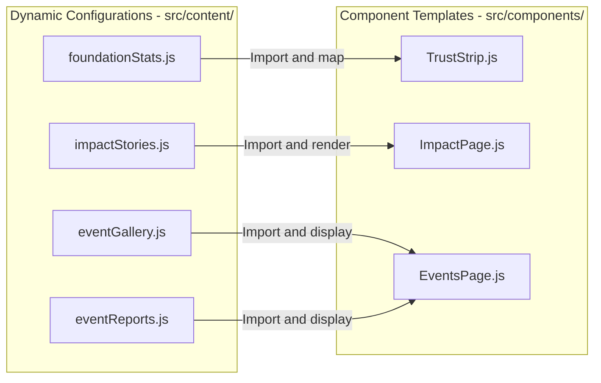

# Content Architecture & Editorial Guide

This document explains the content-layer architecture of the Amaanitvam Foundation Platform. It outlines the separation of concerns between core component rendering logic and dynamic content configurations, serving as a developer and content editor reference.

---

## Document Metadata
* **Owner**: Frontend Team
* **Maintainer**: Content Editor / Lead Developer
* **Reviewer**: Technical Core Team
* **Last Updated**: June 4, 2026
* **Dependencies**: [docs/README.md](file:///d:/Desktop/Amaanitvam-Internship/amaanitvam-platform/docs/README.md), [docs/architecture/frontend-architecture.md](file:///d:/Desktop/Amaanitvam-Internship/amaanitvam-platform/docs/architecture/frontend-architecture.md)

---

## 1. The Separation of Concerns

To allow content managers, copywriters, and non-technical contributors to update website copy, statistics, images, and event details without editing core JavaScript code or styling files, Amaanitvam implements a decoupled **Content Layer**:



- **Core Components (`src/components/`, `src/pages/`)**: These contain the HTML structures, TailwindCSS class bindings, and event handlers. They are **orchestrators** and should remain unchanged during editorial adjustments.
- **Content Configs (`src/content/`)**: These contain pure ES6 array exports containing raw text, URLs, and numeric statistics. They act as local data objects.

---

## 2. Content Files Reference & Mappings

The following JavaScript data files in [src/content/](file:///d:/Desktop/Amaanitvam-Internship/amaanitvam-platform/frontend/src/content/) represent the editorial source of truth:

### A. Foundation Statistics: [foundationStats.js](file:///d:/Desktop/Amaanitvam-Internship/amaanitvam-platform/frontend/src/content/foundationStats.js)
Controls the dynamic numeric values displayed across the homepage counter ribbons.

* **Schema**:
  ```javascript
  {
    id: "stat-unique-id",       // Unique slug identifier
    value: 60,                 // Number to animate or display
    suffix: "+",               // Suffix appended to number
    title: "Category Title",   // Primary metric label
    description: "Sub-desc",   // Mentorship track or project context
    tagline: "Short quote"     // Explanatory tagline
  }
  ```

### B. Impact Stories: [impactStories.js](file:///d:/Desktop/Amaanitvam-Internship/amaanitvam-platform/frontend/src/content/impactStories.js)
Stores the list of featured highlights on the impact portal.

* **Schema**:
  ```javascript
  {
    id: "story-unique-id",
    tag: "Learners & Scholars", // Colored tag header
    tagColorClass: "text-color", // Tailwind color token (e.g. text-pink-ruby)
    title: "Title of Story",
    description: "Detailed summary text of the community milestone",
    dateLabel: "Coming Soon"     // Scheduled release date or status
  }
  ```

### C. Event Gallery: [eventGallery.js](file:///d:/Desktop/Amaanitvam-Internship/amaanitvam-platform/frontend/src/content/eventGallery.js)
Maintains image collections, categories, and captions of past drives.

* **Schema**:
  ```javascript
  {
    id: "gal-unique-id",
    eventId: "evt-linked-id",    // Linked event from mocks/events.js
    image: "https://images.unsplash.com/...", // Absolute image path or CDN link
    caption: "Full explanatory caption text.",
    category: "Awareness"        // Category filter tag
  }
  ```

### D. Event Reports: [eventReports.js](file:///d:/Desktop/Amaanitvam-Internship/amaanitvam-platform/frontend/src/content/eventReports.js)
Stores deep analytical reports of concluded programs.

* **Schema**:
  ```javascript
  {
    id: "rep-unique-id",
    slug: "url-safe-slug",
    title: "Event Headline",
    date: "YYYY-MM-DD",
    location: "Center Name, City",
    category: "Campaign Category",
    programId: "shiksha",        // Linked program track
    objective: "Primary goal...",
    activities: "Detailed descriptions of actions...",
    outcomes: "Measurable metrics and accomplishments...",
    lessonsLearned: "Operational takeaways...",
    author: "Name (Title)",
    publishedDate: "YYYY-MM-DD",
    reviewedBy: "Signatory",
    tags: ["Tag1", "Tag2"],
    metrics: {                   // Impact stats
      participants: 80,
      volunteers: 12,
      hoursContributed: 6,
      communitiesReached: 1,
      resourcesDistributed: 100
    }
  }
  ```

---

## 3. Safe Editing Instructions (for Content Editors)

If you are a content contributor tasked with updating text, copying details, or adding media assets, follow these strict rules to avoid crashing the SPA renderer:

### Safe Actions ✅
1. **Changing Values**: You can freely change text strings within quotes, numbers, or tag names (e.g. changing `value: 60` to `value: 75`).
2. **Adding Elements**: To add a new story or stat card, copy an existing block inside the array, paste it below, separate it with a comma, and change the values (ensuring a unique `id`).
3. **Updating Image Links**: You can substitute media links by replacing URL strings within quotes in the `image` field.

### Forbidden Actions ❌
1. **Deleting JS Syntax**: Never delete commas `,`, brackets `[ ]` `{ }`, or the `export const ...` header. These are required by the Javascript engine.
2. **Using Unescaped Double Quotes**: If you write double quotes within a copy string, escape them or use single quotes:
   * **Incorrect**: `"A volunteer demonstrating "phishing" links."`
   * **Correct**: `"A volunteer demonstrating 'phishing' links."` or `"A volunteer demonstrating \"phishing\" links."`
3. **Changing Keys**: Never rename database keys (e.g., changing `publishedDate` to `pubDate` or `category` to `cat`). The components expect these exact keys, and changing them will render values as `undefined`.

---

## 4. Editorial Verification Workflow

Whenever a content file is modified, the editor should perform the following quick validation checks:
1. **Syntax Check**: Open the browser's developer console (F12) on the local host server. Verify that no console errors appear indicating a `SyntaxError: Unexpected token`.
2. **Visual Inspection**: Navigate to the modified view (e.g., scroll down to the Homepage statistics ribbon or check the Events gallery filter). Verify that all numbers and texts are aligned and do not wrap awkwardly.
3. **Link Validation**: If new external URLs or Unsplash images were introduced, click on the links and inspect them to ensure they load properly without 404 errors.
