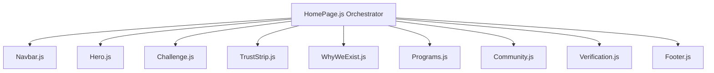

# Homepage Technical Architecture

This document details the code structure, page orchestrator integration, components hierarchy, routing linkages, and layout metrics of the Amaanitvam Foundation homepage.

---

## Document Metadata
* **Owner**: Frontend Team
* **Maintainer**: Lead Developer
* **Reviewer**: Architecture Lead
* **Last Updated**: June 4, 2026
* **Dependencies**: [docs/architecture/frontend-architecture.md](file:///d:/Desktop/Amaanitvam-Internship/amaanitvam-platform/docs/architecture/frontend-architecture.md), [docs/architecture/routes.md](file:///d:/Desktop/Amaanitvam-Internship/amaanitvam-platform/docs/architecture/routes.md)

---

## 1. Page Component Orchestration

The landing page is managed by the page class orchestrator [HomePage.js](file:///d:/Desktop/Amaanitvam-Internship/amaanitvam-platform/frontend/src/pages/HomePage.js). It instantiates and structures sub-components in its constructor:



### Component Registry

* **[Navbar.js](file:///d:/Desktop/Amaanitvam-Internship/amaanitvam-platform/frontend/src/components/Navbar.js)**: Global navigation header, sticky scroll handler, branding visibility, and mobile menu curtain.
* **[Hero.js](file:///d:/Desktop/Amaanitvam-Internship/amaanitvam-platform/frontend/src/components/Hero.js)**: Viewport-cover intro section displaying Playfair display titles, linear gradients, and core entry CTAs.
* **[Challenge.js](file:///d:/Desktop/Amaanitvam-Internship/amaanitvam-platform/frontend/src/components/Challenge.js)**: Focussed tension quote block framing the problem.
* **[TrustStrip.js](file:///d:/Desktop/Amaanitvam-Internship/amaanitvam-platform/frontend/src/components/TrustStrip.js)**: Compact horizontally divided counter ribbon showcasing active statistics from the shared data module.
* **[WhyWeExist.js](file:///d:/Desktop/Amaanitvam-Internship/amaanitvam-platform/frontend/src/components/WhyWeExist.js)**: Core mission/vision vertical timeline representing paths from Today to Tomorrow.
* **[Programs.js](file:///d:/Desktop/Amaanitvam-Internship/amaanitvam-platform/frontend/src/components/Programs.js)**: Three-column card matrix displaying Project Manthan, Shiksha, and Pravah tracks.
* **[Community.js](file:///d:/Desktop/Amaanitvam-Internship/amaanitvam-platform/frontend/src/components/Community.js)**: Participation gateway detailing pathways (Volunteer, Support, Participate).
* **[Verification.js](file:///d:/Desktop/Amaanitvam-Internship/amaanitvam-platform/frontend/src/components/Verification.js)**: Security integrity banner pointing visitors to the verify platform.
* **[Footer.js](file:///d:/Desktop/Amaanitvam-Internship/amaanitvam-platform/frontend/src/components/Footer.js)**: Global loop tagline footer with dynamic lists.

---

## 2. Layout, Vertical Spacing, & Styling Standards

To secure breathing room and maintain editorial quality, sections follow strict spacing standards:
* **Vertical Spacing**: Core sections use `py-36` (`9rem` vertical margin padding) to create breathing room.
* **Vertical Connection Thread**: A subtle, centered timeline connector runs behind sections to guide the user's eye:
  ```html
  <div class="absolute top-0 left-1/2 w-px h-full bg-stone-200/40 -translate-x-1/2 pointer-events-none z-0"></div>
  ```
* **Scroll Animations**: Element reveal indicators utilize the `.scroll-reveal` and `.revealed` classes, coordinated by an IntersectionObserver defined in `HomePage.init()`.

---

## 3. SPA Routing & Link Connections

* **Direct Anchors**: All in-page scroll links (e.g. from the navbar or footer to home page segments) must target clean ID anchors:
  * `#home` (Hero)
  * `#challenge` (Tension)
  * `#trust-strip` (Statistics)
  * `#about` (Mission/Vision)
  * `#programs` (Progression Chapters)
  * `#community` (Collective Action)
  * `#verify-certificate` (Registry Integration)
* **Router Registration**: The client router resolves standard anchors to `HomePage.js` and handles dynamic scrolling, keeping the URL readable and preventing unnecessary page reloads.
