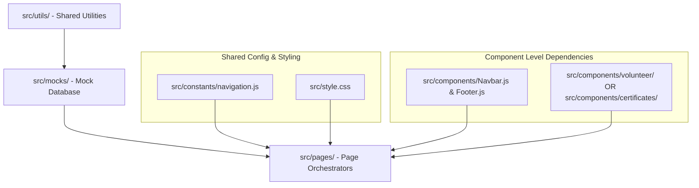

# Frontend Module Registry & Ownership Matrix

This document provides a comprehensive index of all client-side pages and components in the Amaanitvam Foundation Platform. It details the file mappings, team responsibilities, development status, and critical priority actions for each operational module.

---

## Document Metadata
* **Owner**: Technical Core Team
* **Maintainer**: Technical Coordinator
* **Reviewer**: Principal Architect
* **Last Updated**: June 4, 2026
* **Dependencies**: [docs/documentation-map.md](file:///d:/Desktop/Amaanitvam-Internship/amaanitvam-platform/docs/documentation-map.md), [docs/architecture/platform-overview.md](file:///d:/Desktop/Amaanitvam-Internship/amaanitvam-platform/docs/architecture/platform-overview.md)

---

## 1. System Module Registry Grid

The platform comprises seven core user-facing and backend-facing operational modules:

| Module | Primary File / Orchestrator | Sub-Components / Assets | Responsible Team | Development Status | Integration Priority |
| :--- | :--- | :--- | :--- | :--- | :--- |
| **1. Landing & Home** | [HomePage.js](file:///d:/Desktop/Amaanitvam-Internship/amaanitvam-platform/frontend/src/pages/HomePage.js) | `Hero.js`, `Challenge.js`, `TrustStrip.js`, `WhyWeExist.js`, `Programs.js`, `Community.js`, `Verification.js` | Frontend Lead | **Complete** (Refinement Pass Done) | Low (Self-contained static content) |
| **2. About & Programs** | [AboutPage.js](file:///d:/Desktop/Amaanitvam-Internship/amaanitvam-platform/frontend/src/pages/AboutPage.js)   [ProgramsPage.js](file:///d:/Desktop/Amaanitvam-Internship/amaanitvam-platform/frontend/src/pages/ProgramsPage.js) | `AboutHero.js`, `StudentBeginning.js`, `StoryTimeline.js`, `CoreValues.js`, `ProgramsHero.js`, `ProgramsCTA.js` | Content Team | **Complete** (Refinement Pass Done) | Low (Copy & static displays) |
| **3. Impact & Events** | [ImpactPage.js](file:///d:/Desktop/Amaanitvam-Internship/amaanitvam-platform/frontend/src/pages/ImpactPage.js)   [EventsPage.js](file:///d:/Desktop/Amaanitvam-Internship/amaanitvam-platform/frontend/src/pages/EventsPage.js) | `EventDetailsPage.js`, `EventReportPage.js`, `EventReportPublisherPage.js` | Operations / Dev | **Complete** (Reports system active) | Medium (Needs REST endpoints for events) |
| **4. Volunteer Workspace** | [VolunteerPortal.js](file:///d:/Desktop/Amaanitvam-Internship/amaanitvam-platform/frontend/src/pages/VolunteerPortal.js)   [VolunteerDashboard.js](file:///d:/Desktop/Amaanitvam-Internship/amaanitvam-platform/frontend/src/pages/VolunteerDashboard.js) | `Profile.js`, `MyContributions.js`, `ActiveProjects.js`, `MyTeam.js`, `MyTasks.js`, `MyApplications.js` | Dev Team | **Complete** (Mock simulation active) | High (Requires session auth integration) |
| **5. Certificate Registry** | [CertificateVerificationPage.js](file:///d:/Desktop/Amaanitvam-Internship/amaanitvam-platform/frontend/src/pages/CertificateVerificationPage.js) | `CertificateGeneratorPage.js`, `VolunteerCertificates.js` | Security / Dev | **Complete** (QR layouts refactored) | High (Requires database integrity checks) |
| **6. Core Functions** | [ContactPage.js](file:///d:/Desktop/Amaanitvam-Internship/amaanitvam-platform/frontend/src/pages/ContactPage.js)   [DonatePage.js](file:///d:/Desktop/Amaanitvam-Internship/amaanitvam-platform/frontend/src/pages/DonatePage.js) | Form handlers, transaction overlays, payment mock modals | Dev Team | **Complete** (Legal links mapped) | Medium (Needs payment gateway webhooks) |
| **7. Admin Platform** | Multiple files, e.g. [AdminDashboardPage.js](file:///d:/Desktop/Amaanitvam-Internship/amaanitvam-platform/frontend/src/pages/AdminDashboardPage.js) | `AdminAnalyticsPage.js`, `AdminPeoplePage.js`, `AdminPersonProfilePage.js`, `AdminInquiriesPage.js`, `AdminCertificatesPage.js`, `AdminSystemHealthPage.js` | Full Stack Lead | **In Progress** (UI prototype active) | Critical (Requires robust backend auth) |

---

## 2. Module Boundaries & Internal Dependencies

To minimize bundle complexity and avoid circular reference imports, modules are strictly bound by the following hierarchy:

### Dependency Rules:
1. **Utility Libraries**: Files in `src/utils/` must not import anything from `src/components/` or `src/pages/`. They must remain pure, side-effect-free functions.
2. **Components Boundaries**: Components inside `src/components/volunteer/` must not import files from `src/components/admin/` or `src/components/events/` unless they are explicitly registered in a shared UI file.
3. **Constants as Source of Truth**: All page navigation strings and URLs must be imported from [src/constants/navigation.js](file:///d:/Desktop/Amaanitvam-Internship/amaanitvam-platform/frontend/src/constants/navigation.js). Never use hardcoded strings like `href="#/volunteer/dashboard"` directly in templates.

---

## 3. Maintenance Responsibilities

Each section has a designated core group responsible for code health:
- **Frontend Lead**: Reviews pull requests targeting `style.css`, global orchestrators (`main.js`), and core base layouts (`Navbar.js`, `Footer.js`).
- **Dev Team**: Manages active operational workspaces (`VolunteerDashboard.js`, `VolunteerPortal.js`, forms handling).
- **Creative & Content Team**: Owns the configurations under `src/content/` and public assets in `public/`.
- **Principal Architect**: Reviews any modifications targeting ADR decisions, router structures, API contracts, or the admin portal schema.
