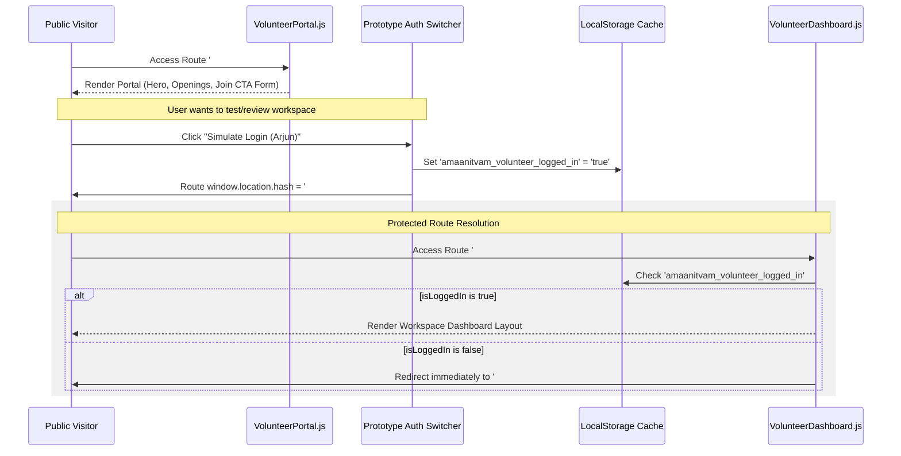

# Volunteer Platform Architecture & Workflows

This document outlines the workflows, component layouts, state management, and mock API interfaces of the Volunteer Platform, comprising the Public Volunteer Portal and the Protected Volunteer Dashboard.

---

## Document Metadata
* **Owner**: Frontend Team / Volunteer Operations
* **Maintainer**: Frontend Lead
* **Reviewer**: Lead Architect
* **Last Updated**: June 4, 2026
* **Dependencies**: [docs/architecture/decisions/ADR-003-mock-data-strategy.md](file:///d:/Desktop/Amaanitvam-Internship/amaanitvam-platform/docs/architecture/decisions/ADR-003-mock-data-strategy.md), [docs/architecture/decisions/ADR-004-certificate-verification-system.md](file:///d:/Desktop/Amaanitvam-Internship/amaanitvam-platform/docs/architecture/decisions/ADR-004-certificate-verification-system.md)

---

## 1. The Volunteer Journey Workflow

The platform handles two states: public/unauthenticated exploration and protected volunteer engagement.



---

## 2. Public Portal Component Stack: [VolunteerPortal.js](file:///d:/Desktop/Amaanitvam-Internship/amaanitvam-platform/frontend/src/pages/VolunteerPortal.js)

The portal presents opportunities to prospective volunteers and routes applications.

* **[VolunteerHero.js](file:///d:/Desktop/Amaanitvam-Internship/amaanitvam-platform/frontend/src/components/volunteer/VolunteerHero.js)**: Hero introduction panel with direct call-to-actions ("Explore Opportunities", "Access Dashboard").
* **[VolunteerOpportunities.js](file:///d:/Desktop/Amaanitvam-Internship/amaanitvam-platform/frontend/src/components/volunteer/VolunteerOpportunities.js)**: Renders available openings (Project Manthan, Shiksha, Pravah, and administrative tasks) imported from mock definitions.
* **[VolunteerCTA.js](file:///d:/Desktop/Amaanitvam-Internship/amaanitvam-platform/frontend/src/components/volunteer/VolunteerCTA.js)**: Interactive application submission form. Collects contact info, domain preferences, skills, and references.
* **[VolunteerJourney.js](file:///d:/Desktop/Amaanitvam-Internship/amaanitvam-platform/frontend/src/components/volunteer/VolunteerJourney.js)**: A horizontal timeline outlining the steps from application to orientation, assignment, and credentialing.

---

## 3. Protected Dashboard Grid Layout: [VolunteerDashboard.js](file:///d:/Desktop/Amaanitvam-Internship/amaanitvam-platform/frontend/src/pages/VolunteerDashboard.js)

Once logged in, the user is redirected to a two-column operational layout structured using CSS grid bounds (`grid-cols-1 lg:grid-cols-12 gap-8`):

### Primary Workspace Column (`lg:col-span-8`)
1. **[MyImpact.js](file:///d:/Desktop/Amaanitvam-Internship/amaanitvam-platform/frontend/src/components/volunteer/workspace/MyImpact.js)**: Visual statistics tracker showing hours contributed, sessions conducted, and certificates earned.
2. **[ActiveProjects.js](file:///d:/Desktop/Amaanitvam-Internship/amaanitvam-platform/frontend/src/components/volunteer/workspace/ActiveProjects.js)**: Workspace cards showing currently assigned projects, cohorts, and coordinator details.
3. **[MyTasks.js](file:///d:/Desktop/Amaanitvam-Internship/amaanitvam-platform/frontend/src/components/volunteer/workspace/MyTasks.js)**: Work assignment trackers containing tabbed sections for Pending, In Progress, and Completed checklist items.
4. **[MyApplications.js](file:///d:/Desktop/Amaanitvam-Internship/amaanitvam-platform/frontend/src/components/volunteer/dashboard/MyApplications.js)**: Logs historical applications, domains, and vetting statuses (Pending, Selected, Under Review).
5. **[EventAttendance.js](file:///d:/Desktop/Amaanitvam-Internship/amaanitvam-platform/frontend/src/components/events/volunteer/EventAttendance.js)**: Lists check-in dates, hours, and approval markers for verified drive sessions.

### Sidebar Column (`lg:col-span-4`)
1. **[MyTeam.js](file:///d:/Desktop/Amaanitvam-Internship/amaanitvam-platform/frontend/src/components/volunteer/workspace/MyTeam.js)**: Metadata displaying details of peers in the same cohort (Lead, Fellow members).
2. **[MyEvents.js](file:///d:/Desktop/Amaanitvam-Internship/amaanitvam-platform/frontend/src/components/events/volunteer/MyEvents.js)**: Dynamic local calendar feed displaying scheduled dates for upcoming orientation sessions or community workshops.
3. **[NotificationsCenter.js](file:///d:/Desktop/Amaanitvam-Internship/amaanitvam-platform/frontend/src/components/volunteer/workspace/NotificationsCenter.js)**: High-priority banners highlighting announcements or coordinator messages.
4. **[VolunteerCertificates.js](file:///d:/Desktop/Amaanitvam-Internship/amaanitvam-platform/frontend/src/components/certificates/volunteer/VolunteerCertificates.js)**: Renders individual credential cards containing QR codes, templates used, certificate verification keys, and download hooks.
5. **[Profile.js](file:///d:/Desktop/Amaanitvam-Internship/amaanitvam-platform/frontend/src/components/volunteer/dashboard/Profile.js)**: Demographics editor managing name, email, domains of interest, skills list, and join dates.

---

## 4. State Persistence & Local Mock Integration

Since the platform utilizes a **Mock-First Architecture** prior to actual backend connections, states are simulated locally:

* **Authentication Switcher**: 
  - A fixed widget at the bottom right allows testing teams to toggle state.
  - Switches `amaanitvam_volunteer_logged_in` in `localStorage`.
  - When simulating "Arjun Mehta", the system filters records (like certificates, notifications, or profiles) to matches matching `Arjun Mehta` to simulate user-scoped query filters.
* **Mock Database Registry**:
  - The dashboard reads data from javascript collections inside [src/mocks/](file:///d:/Desktop/Amaanitvam-Internship/amaanitvam-platform/frontend/src/mocks/).
  - *Example API emulation in `VolunteerCertificates.js`*:
    ```javascript
    import { certificates } from '../../../mocks/certificates.js';
    const myCerts = certificates.filter(cert => cert.recipientName === 'Arjun Mehta');
    ```
* **Simulated Actions**:
  - Actions like updating profile items or marking tasks complete present alerts detailing the backend routes they target (e.g. `GET /api/certificates/download` or `POST /api/volunteer/profile`).
  - In-memory modifications update temporary states during runtime, reverting to file default lists upon full page reloads.
