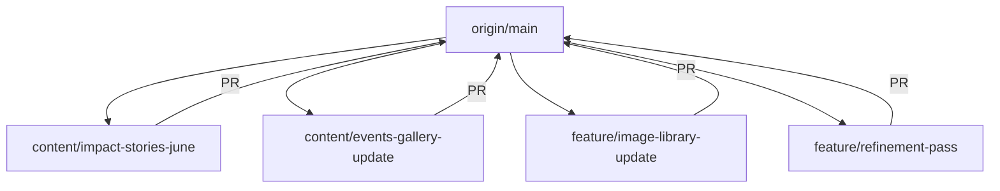

# Amaanitvam Foundation Frontend Contributor & Content Management Guide

Welcome to the Amaanitvam Foundation frontend repository! As our platform grows to encompass multiple portals, dashboards, and databases, this guide ensures that developers, content editors, and maintainers can collaborate seamlessly without conflicts.

To prevent merge conflicts, we have decoupled content copy and media assets from component layout code by creating a dedicated **Content Layer** inside `src/content/`.

---

## SECTION 1: REPOSITORY SYNC WORKFLOW & BRANCH STANDARDS

Before starting **ANY** work, sync your local environment to avoid branching off stale code:

1. **Check out the main branch:**
   ```bash
   git checkout main
   ```
2. **Pull the latest upstream updates:**
   ```bash
   git pull origin main
   ```
3. **Create a dedicated feature branch:**
   Contributors must follow our standardized branch naming conventions. **Never invent arbitrary names.**

### Branch Naming Conventions:
Use the appropriate category prefix followed by a hyphenated description:

| Prefix | Description | Example |
| :--- | :--- | :--- |
| `feature/` | New UI components, routes, or dashboard functionality | `feature/admin-platform` |
| `content/` | Copy revisions, statistics, or gallery updates | `content/impact-stories-june` |
| `fix/` | Bug fixes, layout alignments, or visual corrections | `fix/footer-logo` |
| `refactor/` | Code structure optimizations without behavior changes | `refactor/navbar-scroll-perf` |
| `docs/` | Updates to documentation or contributor guides | `docs/contributor-guide` |

```bash
git checkout -b content/events-gallery-update
```

> [!WARNING]
> * **Never** work directly on the `main` branch.
> * **Never** commit directly to someone else's active feature branch without coordinating.

---

## SECTION 2: PARALLEL DEVELOPMENT MODEL

Our team works concurrently across different modules. Because copy and configurations are isolated, you can work independently:



* **Contributor A (Impact Content):** Works on `content/impact-stories-june` (edits files under `src/content/`).
* **Contributor B (Events Content):** Works on `content/events-gallery-update` (edits files under `src/content/`).
* **Contributor C (Media Updates):** Works on `feature/image-library-update` (adds assets to `public/images/`).
* **Lead Architect:** Works on `feature/refinement-pass` (modifies layout components under `src/components/` and routing under `src/main.js`).

---

## SECTION 3: THE CONTENT LAYER & STATISTICS GOVERNANCE

Content editors should **not** modify JavaScript components directly. Instead, all editable marketing copy, images, and metrics are isolated inside:

`src/content/`

The content layer consists of:

| File Name | Target Section | Component Consumer |
| :--- | :--- | :--- |
| [`impactStories.js`](file:///d:/Desktop/Amaanitvam-Internship/amaanitvam-platform/frontend/src/content/impactStories.js) | Impact Page Stories | [`ImpactStories.js`](file:///d:/Desktop/Amaanitvam-Internship/amaanitvam-platform/frontend/src/components/impact/ImpactStories.js) |
| [`impactGallery.js`](file:///d:/Desktop/Amaanitvam-Internship/amaanitvam-platform/frontend/src/content/impactGallery.js) | Impact Page Media Grid | [`JourneyGallery.js`](file:///d:/Desktop/Amaanitvam-Internship/amaanitvam-platform/frontend/src/components/impact/JourneyGallery.js) |
| [`eventReports.js`](file:///d:/Desktop/Amaanitvam-Internship/amaanitvam-platform/frontend/src/content/eventReports.js) | Past Events Reports | [`EventReportsArchive.js`](file:///d:/Desktop/Amaanitvam-Internship/amaanitvam-platform/frontend/src/components/events/EventReportsArchive.js) & [`EventReportPage.js`](file:///d:/Desktop/Amaanitvam-Internship/amaanitvam-platform/frontend/src/pages/EventReportPage.js) |
| [`eventGallery.js`](file:///d:/Desktop/Amaanitvam-Internship/amaanitvam-platform/frontend/src/content/eventGallery.js) | Events Page Media Grid | [`EventGallery.js`](file:///d:/Desktop/Amaanitvam-Internship/amaanitvam-platform/frontend/src/components/events/EventGallery.js) |
| [`foundationStats.js`](file:///d:/Desktop/Amaanitvam-Internship/amaanitvam-platform/frontend/src/content/foundationStats.js) | Foundation Metrics Strip | [`TrustStrip.js`](file:///d:/Desktop/Amaanitvam-Internship/amaanitvam-platform/frontend/src/components/TrustStrip.js) & [`ImpactSnapshot.js`](file:///d:/Desktop/Amaanitvam-Internship/amaanitvam-platform/frontend/src/components/impact/ImpactSnapshot.js) |

### Statistics Single Source of Truth:
All public key indicators (such as numbers of children supported, clothing drives, and lives reached) must be read from [`foundationStats.js`](file:///d:/Desktop/Amaanitvam-Internship/amaanitvam-platform/frontend/src/content/foundationStats.js). 

> [!IMPORTANT]
> **Do not manually write or alter numbers inside raw components.** This ensures that different pages (e.g. Homepage and Impact page) are always in perfect statistical sync.

---

## SECTION 4: UPDATING IMPACT STORIES & CONTENT ACCURACY

To replace story copy, edit [`impactStories.js`](file:///d:/Desktop/Amaanitvam-Internship/amaanitvam-platform/frontend/src/content/impactStories.js). 

Each story follows this format:
```javascript
{
  id: "story-unique-id",
  tag: "Learners & Scholars", // Card category header
  tagColorClass: "text-pink-ruby", // Text styling color (Tailwind)
  title: "Community Story", // Story title
  description: "Experiences and educational milestones...", // Body copy
  dateLabel: "Coming Soon" // Or calendar date
}
```

### Placeholder Replacement Rules:
* [x] **DO NOT INVENT DATA:** We have a strict policy against fictionalizing metrics, events, or volunteer experiences. All stories and stats must originate from verified Amaanitvam field operations.
* [x] **No Mock Figures:** Do not create fake attendance listings or make up event summaries to fill visual empty spaces. If data is pending, use `"Data compiling..."` or coordinate with leadership.

---

## SECTION 5: GALLERY SCHEMAS & IMAGE NAMING CONVENTIONS

To edit the photo showcase on the Impact page, modify [`impactGallery.js`](file:///d:/Desktop/Amaanitvam-Internship/amaanitvam-platform/frontend/src/content/impactGallery.js).

```javascript
{
  id: "img-unique-id",
  category: "learning", // Filter target (learning, community, awareness, volunteers)
  tag: "Learning Sessions",
  tagColorClass: "text-pink-ruby",
  image: "/images/impact/manthan-learning-session-2026-05.jpg",
  alt: "Active learning class session in Mehrauli center",
  description: "Active learning classes promoting academic support..."
}
```

### Image Naming Conventions:
Do not upload files named `image1.jpg`, `temp.png`, or `final.jpg`. Images placed in the repository must be named descriptively using the following layout format:

`[program]-[event/purpose]-[location/center]-[year]-[month].[ext]`

* **Correct:** `manthan-learning-session-mehrauli-2026-05.jpg`
* **Correct:** `pravah-health-awareness-outreach-2026-06.jpg`
* **Incorrect:** `photo1.jpg`, `child.jpg`, `image-edited.png`

---

## SECTION 6: EVENTS PLATFORM CONTENT

To edit the upcoming announcements and past archive summaries, use:
* [`eventReports.js`](file:///d:/Desktop/Amaanitvam-Internship/amaanitvam-platform/frontend/src/content/eventReports.js)
* [`eventGallery.js`](file:///d:/Desktop/Amaanitvam-Internship/amaanitvam-platform/frontend/src/content/eventGallery.js)

These files allow you to customize event tags, registration limits, attendee numbers, locations, and coordinator names.

---

## SECTION 7: ADDING EVENT REPORTS & WORKFLOW

To publish a completed event report, append a new object to the `eventReports` array inside [`eventReports.js`](file:///d:/Desktop/Amaanitvam-Internship/amaanitvam-platform/frontend/src/content/eventReports.js).

### The Content Lifespan:
Follow this workflow to submit content updates:

```text
Field Operations Group
   ├── Compiles reports & metrics
   └── Uploads raw photos to Foundation Drive
            │
            ▼
Content Editor
   ├── Downloads & compresses assets (max 250KB)
   ├── Renames images to match naming guidelines
   ├── Copies text into src/content/ files
   └── Launches a content/ branch
            │
            ▼
Local Validation & PR
   ├── Runs 'npm run build' check
   ├── Takes staging screenshot / verifies layouts
   └── Submits Pull Request to GitHub
            │
            ▼
Lead Reviewer
   ├── Reviews PR and content accuracy
   └── Merges branch to main
```

---

## SECTION 8: IMAGE MANAGEMENT & DRIVE WORKFLOW

1. **Obtain Approved Assets:** Access the official Amaanitvam Foundation Drive.
2. **Compress Media:** Target files under 250KB to preserve website load speeds.
3. **Move and Rename:** Place the renamed image files inside:
   ```text
   public/images/
   ├── impact/
   ├── events/
   ├── programs/
   ├── volunteer/
   └── internships/
   ```
4. **Reference Internally:** Update the content layer JSON path.

> [!CAUTION]
> **Never link direct Google Drive sharing URLs** as image sources. Direct links are not optimized, can break, and slow down page performance. Always host assets inside `public/images/`.

---

## SECTION 9: CONTRIBUTOR RULES & PROTECTED FILES

To maintain system architecture stability, we enforce strict permissions on code edits:

```text
  [ Content Contributor ]         [ Developer / Engineer ]        [ Backend Integrator ]
          │                               │                               │
          ▼                               ▼                               ▼
Edits src/content/*.js           Modifies src/components/*.js   Replaces mock endpoints
Alters statistics copy           Edits CSS and grid classes     Integrates APIs & databases
Adds compressed images           Hooks up new SPA route files   Sets up session auth tokens
```

### Protected Files List:
Unless explicitly assigned by the Lead Developer, content contributors are **prohibited** from editing these files:
* `src/main.js` (Routing system orchestrator)
* `src/components/Navbar.js` & `src/components/Footer.js` (Global headers and menus)
* `src/components/volunteer/dashboard/*` & `src/components/volunteer/workspace/*` (Interactive dashboard layouts)
* `src/components/admin/*` (Operations Center tools)

---

## SECTION 10: PR PROCESS & CONFLICT RESOLUTION

Once changes are done, commit and push:
```bash
git status
git add .
git commit -m "content: add community awareness workshop report"
git push origin content/events-gallery-update
```

Open a PR from your branch to `main`. Include layout screenshots, source validation checklist, and list of updated files.

### Merge Conflict Resolution:
If Git reports conflicts because other contributors merged changes before you:

1. **Get the latest changes:**
   ```bash
   git checkout main
   git pull origin main
   ```
2. **Checkout your working branch:**
   ```bash
   git checkout content/events-gallery-update
   ```
3. **Merge main into your branch:**
   ```bash
   git merge main
   ```
4. **Resolve conflicts:**
   Open files containing conflicts, search for `<<<<<<< HEAD`, choose the correct content, clean up markers, run `npm run build` to confirm compilation, and commit:
   ```bash
   git add .
   git commit -m "merge: resolve conflict with main"
   git push origin content/events-gallery-update
   ```

---

## SECTION 11: REVIEW & VERIFICATION CHECKLISTS

### Content Editor Checklist:
* [ ] **Spelling & Grammar:** Copy passed through language checking tools.
* [ ] **No Fictional Data:** All statistics, hours, and attendee records correspond to actual logs.
* [ ] **Verified Names:** spelling of coordinators, volunteers, and partners matches records.
* [ ] **No Placeholders:** Checked that text blocks do not contain "Coming Soon", "Lorem Ipsum", or mock names.
* [ ] **Image Compression:** File sizes are verified to be under 250KB.

### Technical Developer Checklist:
* [ ] **Clean Compilation:** `npm run build` exits with code `0` (no warnings/failures).
* [ ] **Responsiveness:** Validated on Desktop (1200px+), Tablet (768px), and Mobile (375px).
* [ ] **No Console Errors:** Browser console is clear during navigation.
* [ ] **Route Auditing:** Verified no broken routes exist on link clicks.

---

## SECTION 12: RELEASE WORKFLOW

To coordinate production deployments, the project follows a bi-weekly cycle:

```text
[1. Release Candidate] ──► [2. Frontend Freeze] ──► [3. Content Freeze] ──► [4. QA Pass] ──► [5. Production Release]
```

1. **Release Candidate (RC):** Active features are compiled into the release candidate branch.
2. **Frontend Freeze:** Development stops on components to allow testing.
3. **Content Freeze:** Final updates to statistics and event reports are merged.
4. **QA Pass:** Verification checklist runs across target devices and viewports.
5. **Production Release:** The branch is merged into `main` and pushed to the hosting infrastructure.

---

## SECTION 13: PROJECT OWNERSHIP MATRIX

To prevent overlapping contributions, we organize code ownership across specific team boundaries:

| Workspace Area / Feature Module | Responsible Team | Scope / Files Included |
| :--- | :--- | :--- |
| **Home (Landing Page)** | Frontend Lead | `src/pages/Home.js`, `src/components/Hero.js`, `TrustStrip.js` |
| **About Us** | Frontend Lead | `src/pages/About.js`, `src/components/AboutHero.js` |
| **Programs** | Frontend Lead | `src/pages/Programs.js`, `src/components/Programs.js` |
| **Impact Content** | Content Team | `src/content/impactStories.js`, `src/content/impactGallery.js` |
| **Events Content** | Content Team | `src/content/eventReports.js`, `src/content/eventGallery.js` |
| **Volunteer Portal & Dashboard** | Frontend Team | `src/pages/VolunteerPortal.js`, `src/components/volunteer/*` |
| **Internship Portal & Dashboard** | Frontend Team | `src/pages/Internships.js`, `src/components/internships/*` |
| **Certificate System** | Frontend + Backend | `src/components/certificates/*`, `src/mocks/certificates.js` |
| **Admin Operations Center** | Frontend Lead | `src/pages/AdminDashboardPage.js`, `src/components/admin/*` |
| **Authentication & Sessions** | Backend Team | JWT, Sessions, local storage mock middleware guards |
| **Database Schemas** | Backend Team | Mock models, entities, and API payloads |
| **Deployment / CI-CD** | Technical Lead | `vite.config.js`, package scripts, server configurations |

---

## SECTION 14: FILE STRUCTURE OVERVIEW

The frontend codebase is organized as follows:

```text
amaanitvam-platform/
└── frontend/
    ├── src/
    │   ├── assets/         # Static global visual resources
    │   ├── components/     # UI Component definitions (grouped by module)
    │   │   ├── admin/      # Operations Center views
    │   │   ├── volunteer/  # Volunteer portal widgets and modals
    │   │   └── impact/     # Impact visual blocks
    │   ├── content/        # Content Layer (JSON objects for marketing copy)
    │   │   ├── impactStories.js
    │   │   ├── impactGallery.js
    │   │   ├── eventReports.js
    │   │   └── foundationStats.js
    │   ├── mocks/          # Mock data arrays (simulated API databases)
    │   ├── pages/          # Full page layouts (SPA mount targets)
    │   ├── styles/         # Global stylesheets (Vanilla CSS and utility assets)
    │   └── main.js         # Client-side router configuration (App mount root)
    └── public/
        └── images/         # Compressed graphics directory
            ├── impact/     # Impact case photos
            ├── events/     # Campaign snapshots
            ├── volunteer/  # Volunteer onboarding images
            └── internships/# Internship track visual assets
```

---

## SECTION 15: BACKEND INTEGRATION CONTRACTS

As we transition from frontend mock data to live databases, we map mock mockfiles to future API endpoint specifications to simplify backend integration:

```text
    Local Mock Datastore                REST API Route                  Expected JSON Return Shape
 ┌───────────────────────┐          ┌─────────────────────┐          ┌───────────────────────────────┐
 │                       │          │                     │          │  [                            │
 │  src/mocks/tasks.js   │  ──────► │  GET /api/tasks     │  ──────► │    { id, title, status }      │
 │                       │          │                     │          │  ]                            │
 └───────────────────────┘          └─────────────────────┘          └───────────────────────────────┘
```

The primary contract relationships are mapped as follows:

* **Volunteers Ledger:**
  - Mock File: `src/mocks/profile.js`
  - Target Endpoint: `GET /api/volunteer/profile` (Authenticated context)
  - Method: `GET` & `PUT`
* **Active Projects Tracker:**
  - Mock File: `src/mocks/projects.js`
  - Target Endpoint: `GET /api/volunteer/projects`
* **Credential Verifications:**
  - Mock File: `src/mocks/certificates.js`
  - Target Endpoint: `GET /api/verify?code=:code`
* **Inquiries Ticketing:**
  - Mock File: `src/mocks/admin/inquiriesAdmin.js`
  - Target Endpoint: `POST /api/inquiries`
